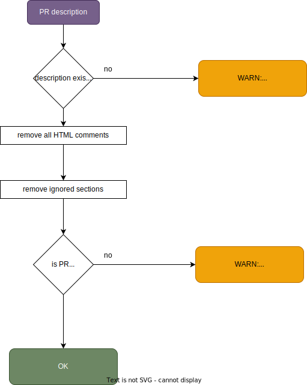

# Pull Request (PR) sufficient Description

-   code: `src/rulePrDescription.ts`
-   rule failing output is: `warn` (⚠️ )

The description of a pull request (PR) helps others understand the changes that have been made. Here's how to create a good description.

<div align="center">
</a>
</div>
<br>

-   **What's Considered as the Description?** The PR description includes all text outside of typical metadata sections like `## Related` or `## Breaking Changes` (ignored sections can be configured). HTML comments in the PR description are also ignored. For example, if sections such as `## Related` and `## Breaking Changes` are marked as ignored, their content will not count towards the description's length.

-   **Configurable Parameters:**
    -   Sections can be configured to be ignored when evaluating the PR description's length. Ignored sections are defined by the workflow variable `description-ignore-sections`. By default, sections starting with `## Release ...`, `## Related ...`, and `## Breaking Change ...` are ignored.
    -   The minimum length of the PR description can also be configured (using the workflow variable `description-min-length`); the default is 50 characters.

---

## Custom Configuration

Disable this rule:

<!-- prettier-ignore -->
```yaml
    - name: DangerJS pull request linter
      uses: espressif/shared-github-dangerjs@v1
      with:
        rule-description: 'false'
```

To ignore the sections `Release notes` and `Testing`, with a minimum PR description length of 100 characters:

<!-- prettier-ignore -->
```yaml
    - name: DangerJS pull request linter
      uses: espressif/shared-github-dangerjs@v1
      with:
        description-min-length: '100'
        description-ignore-sections: 'Release notes,Testing'
```

Do not ignore any sections (except HTML comments):

<!-- prettier-ignore -->
```yaml
    - name: DangerJS pull request linter
      uses: espressif/shared-github-dangerjs@v1
      with:
        description-ignore-sections: ''
```

---

-   [Back to README](../../README.md)
